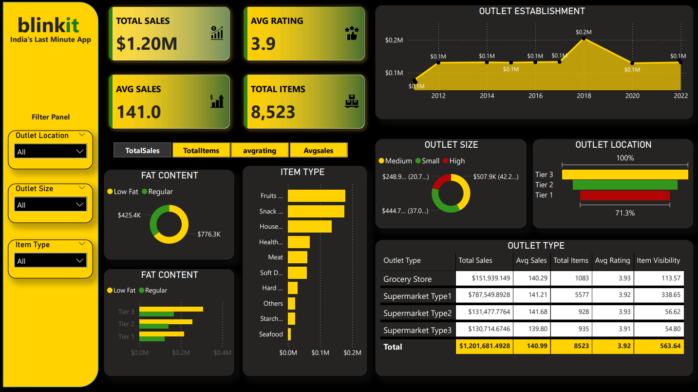

# 🛒 Blinkit Power BI Data Analysis

*Retail-sales data analysis for Blinkit outlets & products, visualized with Power BI to inform business strategy.*

---

## 📌 Table of Contents
- <a href="#overview">Overview</a>
- <a href="#business-problem">Business Problem</a>
- <a href="#dataset">Dataset</a>
- <a href="#tools--technologies">Tools & Technologies</a>
- <a href="#project-structure">Project Structure</a>
- <a href="#dashboard">Dashboard Features</a>
- <a href="#research-questions--key-findings">Key Insights</a>
- <a href="#how-to-run-this-project">How to Run This Project</a>
- <a href="#final-recommendations">Final Recommendations</a>
- <a href="#author--contact">Author & Contact</a>

---
<h2><a class="anchor" id="overview"></a>Overview</h2>

This project focuses on analyzing Blinkit’s (formerly Grofers) retail outlet sales data using Power BI. The aim is to uncover patterns & trends in the performance of outlets, product categories, and customer preferences, and to derive actionable insights for improving sales, operations and marketing decisions.

---
<h2><a class="anchor" id="business-problem"></a>Business Problem</h2>

Blinkit wants to understand:  
- Which products and outlets are performing best — and which are underperforming.  
- How outlet location, size, and type affect sales.  
- What customer preferences look like by product category (e.g. item type, fat content).  
- How ratings correlate with sales across locations.  
- Where to focus resources or strategies to increase sales & customer satisfaction.

---
<h2><a class="anchor" id="dataset"></a>Dataset</h2>

- **BlinkIT Grocery Data.xlsx**: Contains sales data, item/product info, outlet details, etc.  
- Fields include: outlet location, outlet size, outlet type; item type; product attributes (e.g. fat content); item sales, quantity sold; outlet ratings.

---

<h2><a class="anchor" id="tools--technologies"></a>Tools & Technologies</h2>

- **Power BI**: Dashboard building and visualization  
- **Excel**: Data preprocessing & cleaning  
- **DAX**: For KPIs, filters, metrics within Power BI  

---
<h2><a class="anchor" id="project-structure"></a>Project Structure</h2>

```
vendor-performance-analysis/
│
├── README.md
├── Blinkit_Project_Report.pdf
├── Blinkit Grocery Data.xlsx
│
├── dashboard/                  # Power BI dashboard file
│   └── Blinkit_dashboard.pbix
├── images/                  # Power BI dashboard screenshot
│   └── Blinkit_dashboard.png
```

---
<h2><a class="anchor" id="dashboard"></a>Dashboard Features</h2>

- KPI Cards (e.g. Total Sales, Average Rating, Total Items Sold)  
- Filters for Outlet Location, Outlet Size, Item Type  
- Bar charts, Donut charts, Line graphs, Tables for drill-down views  
- Visualizations of: Outlet performance, Product category trends, Rating vs sales  

---



---
<h2><a class="anchor" id="research-questions--key-findings"></a>Key Insights</h2>

- **Total Sales**: ~$1.20M  
- **Average Rating**: ~3.9 / 5  
- **Total Items Sold**: 8,523  
- **Outlet Type Performance**: Supermarket-Type-1 outlets generate the highest revenues  
- **Location Trends**: Tier-3 cities outperform Tier-1 & Tier-2 in certain product categories  
- **Category-wise Trends**: Fruits and Snacks are among the highest selling item types  
- **Product Attributes**: Regular-fat content items sell more than low-fat ones in this dataset  

---

<h2><a class="anchor" id="how-to-run-this-project"></a>How to Run This Project</h2>

1. Clone the repository:
```bash
git clone https://github.com/yourusername/Blinkit-Power-BI-Data-Analysis.git
```
3. Open the dataset in Excel (if you want to preview or preprocess data)
4. Open Blinkit Dashboard.pbix in Power BI Desktop.
5. Interact with the dashboard: apply filters (by outlet, product type, location, etc.), explore KPI cards, and view visual charts.
6. Export or share insights via the Power BI file or Blinkit Dashboard.pdf for stakeholders.

---
<h2><a class="anchor" id="final-recommendations"></a>Final Recommendations</h2>

- Focus marketing & supply chain resources on high-performing outlet types (e.g. Supermarket-Type-1).
- Explore opportunities in Tier-3 locations, given their strong performance in some categories.
- Analyze customer feedback/rating further to see how rating improvements (e.g. via service or stock availability) can boost sales.
- Consider product-level strategies: since Fruits & Snacks sell well, see if similar adjacent categories can be expanded.
- Use dashboard insights regularly to monitor performance and adjust operational or stocking strategies.

---
<h2><a class="anchor" id="author--contact"></a>Author & Contact</h2>

**Vaibhav Gupta**  
Data Analyst  
📧 Email: vaibhav.gupta.career@gmail.com
🔗 [LinkedIn](https://www.linkedin.com/in/guptavaibhav01/)
